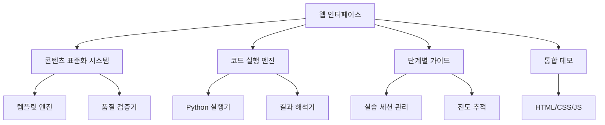

# 교육 콘텐츠 개선 설계 문서 (단순화 버전)

## 개요

통계학습 교육 플랫폼의 4가지 핵심 기능을 구현하여 학습자가 개념을 이해하고 즉시 실습할 수 있는 실용적인 환경을 구축합니다.

## 아키텍처

### 전체 시스템 구조



### 핵심 컴포넌트

#### 1. 콘텐츠 표준화 시스템
- **목적**: 일관된 품질의 교육 콘텐츠 제공
- **구성요소**:
  - 콘텐츠 템플릿 엔진
  - 품질 검증 도구
  - 자동 포맷팅 시스템

#### 2. 인라인 코드 실행 및 결과 해석
- **목적**: 코드 실행과 결과 해석의 seamless한 연결
- **구성요소**:
  - Python 코드 실행기
  - 결과 해석 가이드
  - 오류 처리 시스템

#### 3. 단계별 실습 가이드
- **목적**: 점진적 학습 지원
- **구성요소**:
  - 실습 세션 관리
  - 단계별 힌트 시스템
  - 진도 추적 기능

#### 4. 통합 데모 시스템
- **목적**: 모든 기능의 통합 제공
- **구성요소**:
  - 웹 기반 인터페이스
  - 기술통계량 학습 데모
  - 결과 저장 기능

## 컴포넌트 및 인터페이스

### 1. 콘텐츠 표준화 시스템

#### ContentStandardizer 클래스
```python
class ContentStandardizer:
    def __init__(self):
        self.formatter = AutoFormatter()
    
    def standardize_content(self, content_data: dict) -> dict:
        """콘텐츠 데이터 표준화"""
        return self.formatter.format_content(content_data)
    
    def generate_markdown(self, content_data: dict) -> str:
        """마크다운 생성"""
        pass
```

#### 기본 콘텐츠 구조
```python
content_template = {
    "title": "개념명",
    "difficulty_level": "foundation|intermediate|advanced", 
    "estimated_time": 30,  # 분
    "sections": {
        "concept_introduction": {"content": "개념 설명"},
        "practical_example": {"content": "실습 예제"},
        "code_blocks": [{"code": "Python 코드", "explanation": "설명"}]
    }
}
```

### 2. 인라인 코드 실행 및 결과 해석

#### CodeExecutor 클래스
```python
class CodeExecutor:
    def execute_python_code(self, code: str) -> dict:
        """Python 코드 실행"""
        try:
            # 코드 실행 로직
            result = exec(code)
            return {"success": True, "output": result}
        except Exception as e:
            return {"success": False, "error": str(e)}
```

#### ResultInterpreter 클래스
```python
class ResultInterpreter:
    def interpret_result(self, result: dict, concept_type: str) -> dict:
        """결과 해석"""
        return {
            "statistical_meaning": "통계적 의미",
            "practical_interpretation": "실무적 해석",
            "recommendations": ["추천사항"]
        }
```

### 3. 단계별 실습 가이드

#### StepByStepGuide 클래스
```python
class StepByStepGuide:
    def create_session(self, concept_id: str) -> dict:
        """실습 세션 생성"""
        return {
            "session_id": "unique_id",
            "concept_id": concept_id,
            "steps": self._get_steps_for_concept(concept_id),
            "current_step": 0
        }
    
    def get_current_step(self, session_id: str) -> dict:
        """현재 단계 조회"""
        pass
    
    def submit_step(self, session_id: str, code: str, output: str) -> dict:
        """단계 제출 및 검증"""
        pass
```

### 4. 통합 데모 시스템

#### IntegratedDemo 클래스
```python
class IntegratedDemo:
    def __init__(self):
        self.content_standardizer = ContentStandardizer()
        self.code_executor = CodeExecutor()
        self.result_interpreter = ResultInterpreter()
        self.step_guide = StepByStepGuide()
    
    def create_demo_page(self, concept: str) -> str:
        """통합 데모 페이지 생성"""
        return self._generate_html_demo(concept)
```

## 데이터 모델

### 기본 데이터 구조

```python
# 콘텐츠 데이터
content_data = {
    "title": str,
    "difficulty_level": str,  # foundation, intermediate, advanced
    "estimated_time": int,    # 분 단위
    "sections": {
        "concept_introduction": {"content": str},
        "practical_example": {"content": str},
        "code_blocks": [{"code": str, "explanation": str}]
    }
}

# 실습 세션 데이터
session_data = {
    "session_id": str,
    "concept_id": str,
    "steps": [
        {
            "step_id": str,
            "title": str,
            "description": str,
            "code_template": str,
            "hints": [str],
            "status": str  # not_started, in_progress, completed
        }
    ],
    "current_step": int,
    "progress": float  # 0-100%
}

# 실행 결과 데이터
execution_result = {
    "success": bool,
    "output": str,
    "error": str,
    "interpretation": {
        "statistical_meaning": str,
        "practical_interpretation": str,
        "recommendations": [str]
    }
}
```

## 오류 처리

### 기본 오류 처리 전략

#### 1. 코드 실행 오류
```python
def handle_code_execution_error(error: Exception) -> dict:
    """코드 실행 오류 처리"""
    return {
        "success": False,
        "error": str(error),
        "user_message": "코드 실행 중 오류가 발생했습니다. 문법을 확인해주세요.",
        "suggestions": ["문법 오류 확인", "변수명 확인", "라이브러리 import 확인"]
    }
```

#### 2. 콘텐츠 로드 오류
```python
def handle_content_load_error(content_path: str, error: Exception) -> dict:
    """콘텐츠 로드 오류 처리"""
    return {
        "success": False,
        "error": f"콘텐츠 로드 실패: {content_path}",
        "user_message": "콘텐츠를 불러올 수 없습니다. 잠시 후 다시 시도해주세요.",
        "fallback": "기본 콘텐츠 표시"
    }
```

#### 3. 세션 관리 오류
```python
def handle_session_error(session_id: str, error: Exception) -> dict:
    """세션 관리 오류 처리"""
    return {
        "success": False,
        "error": f"세션 오류: {session_id}",
        "user_message": "세션에 문제가 발생했습니다. 새로 시작해주세요.",
        "action": "restart_session"
    }
```

## 테스트 전략

### 기본 테스트
- 콘텐츠 표준화 기능 테스트
- 코드 실행 및 오류 처리 테스트
- 단계별 가이드 진행 테스트
- 통합 데모 페이지 로드 테스트

### 사용자 테스트
- 기본 사용 시나리오 테스트
- 오류 상황 처리 테스트
- 브라우저 호환성 테스트

## 보안 고려사항

### 코드 실행 보안
- 안전한 Python 코드 실행 환경
- 악성 코드 실행 방지
- 시스템 리소스 사용 제한

### 기본 보안
- 입력 데이터 검증
- XSS 공격 방지
- 기본적인 접근 제어